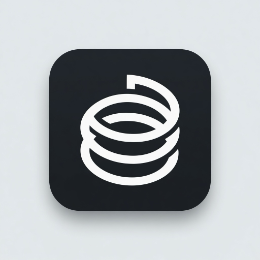

<p align="center">
  
</p>

<h1 align="center">AOS — Agent Operations Stack</h1>

<p align="center">
  <a href="https://www.npmjs.com/package/@albsugy/aos"></a>
  <a href="https://github.com/albsugy/aos/actions/workflows/ci.yml"></a>
  <a href="LICENSE"></a>
  <a href="package.json"></a>
</p>

Governance and continuity for every coding agent you use. One policy, one
project memory, one audit trail — installed as hooks so they work without
anybody invoking anything.

**Spec Kit tells the agent what to build; AOS proves it followed the rules.**

Markdown, YAML, and JSONL under your home directory. Open source (MIT). No
network calls. No account.

```bash
npm i -g @albsugy/aos
cd your-repo && aos init --hooks-only          # Claude Code
aos init --agent all                           # Claude Code + Codex + Cursor + pi + opencode (+ context for Devin/Gemini)
aos init --agent auto                          # whichever agents are installed here
```

That's a complete install. From the next session on, in this repo, with any
wired agent: context is injected at session start, risky commands and writes
are gated, and every tool call is audited.

- **[Install](#install)**
- **[Quickstart](#quickstart)**
- **[Features](#features)**
- **[Agents](#agents)**
- **[What's enforced](#whats-enforced-and-whats-convention)**
- **[Documentation](#documentation)**
- **[Contributing](#contributing)**

---

## Features

| | |
|---|---|
| **Gates** | Forbidden commands denied, gated ones asked. Shell paths (`tee`, `>`, `sed -i`) are parsed, not grepped. Evasive forms (`git -C . push`, `rm -Rf /*`) are caught structurally. |
| **Self-protection** | An agent cannot edit hook wiring, `.git/hooks/`, AOS policy/audit files, or the pending-approval ledger without you. |
| **Plan & scope** | Implementation writes stay blocked until a human approves the plan. A `## Files` list in `plan.md` gates writes outside it. |
| **Review gate** | `aos run finish` refuses while the adversarial review is missing, malformed, or still open. |
| **Human sign-off** | Closing a run is recorded: gate prompt, terminal, `aos approve` (Codex/Cursor), or the CI env var. |
| **Audit** | Every tool call and verdict lands in a hash-chained `audit.jsonl`. `aos audit verify` is CI-gateable. |
| **Evidence** | Replay real traffic against a candidate policy. Ingest Claude Code history. Opt-in executable findings. |
| **Local-only** | Console binds `127.0.0.1`. The CLI makes zero network calls. |

The gates are hooks, so they hold whether or not the agent cooperates. The
ticket pipeline is markdown, so it holds only as well as the model follows it.
This README is explicit about which is which.

AOS sits next to spec and task tools, not against them. Spec Kit, Taskmaster,
BMAD and the like decide what the work is; AOS proves it followed the rules
while the work is done.

## Install

Requires **Node ≥ 22**.

**npm**

```bash
npm i -g @albsugy/aos
```

**curl** (verifies the registry sha-512, unpacks to `~/.local/share/aos`, links
`~/.local/bin/aos`)

```bash
curl -fsSL https://cdn.jsdelivr.net/npm/@albsugy/aos/install.sh | bash
```

Pin with `AOS_VERSION=0.13.0`. Update with `aos update`. Diagnose with
`aos doctor`.

**From source**

```bash
git clone https://github.com/albsugy/aos.git && cd aos
npm ci && npm run build
ln -sf "$PWD/dist/aos.mjs" ~/.local/bin/aos
```

Releases carry npm
[provenance attestations](https://docs.npmjs.com/generating-provenance-statements).

Uninstall: `rm -rf ~/.local/share/aos ~/.local/bin/aos` — data in `~/.aos` stays.

## Quickstart

```bash
cd your-repo
aos init                 # Claude Code: hooks + skills + project memory
aos init --agent all     # every supported agent
aos doctor --capabilities
```

Fill in the two files that matter:

- `~/.aos/projects/<id>/context/pack.md` — what every agent must know
- `~/.aos/projects/<id>/policy.yaml` — gates + verification contracts

Then, in a session with any wired agent, run the **aos-ticket** skill. The
six-stage pipeline ends `awaiting-review`.

```bash
aos status               # runs, states, leverage, tokens, estimated cost
aos context sync         # regenerate AGENTS.md / GEMINI.md after editing memory
aos console              # http://127.0.0.1:4560
```

`aos doctor` is worth running after any move or update: hook commands end in
`|| true` so a missing `aos` can never break a session — which also means it
would otherwise turn every gate off silently. Doctor resolves them and says so.

If you only want the hooks (no pipeline skills): `aos init --hooks-only`.

## Agents

Support is stated honestly per agent — `aos doctor --capabilities` prints this
from the same code that enforces it:

| Agent | Gates | Audit | Approvals | Writes | Level |
|---|---|---|---|---|---|
| Claude Code | ✓ | ✓ | native prompt | ✓ | full enforcement |
| Codex | ✓ | ✓ | via `aos approve` | ✓ (`apply_patch`) | full enforcement — trust hooks once (`/hooks` in Codex) |
| Cursor | ✓ | ✓ | via `aos approve` | ✓ | full enforcement |
| pi | ✓ | ✓ | via `aos approve` | ✓ | full enforcement — gate extension at `.pi/extensions/` (loads once pi trusts the project) |
| opencode | ✓ | ✓ | via `aos approve` | ✓ | full enforcement — gate plugin at `.opencode/plugins/` (auto-loads) |
| Devin CLI | — | — | — | — | workflow compatibility (AGENTS.md + skills in `.agents/skills/`) |
| Gemini CLI | — | — | — | — | workflow compatibility (context file + Git/CI gates) |

Neither Codex, Cursor, pi, nor opencode can surface a native *ask* prompt from their
interception surfaces today.
A gated operation is **denied pending a human approval**: the denial carries
`aos approve <id>`, a human grants it outside the agent, and the same operation
is allowed through exactly once. Never silently allowed, never permanently
denied. Agents cannot approve their own unlocks.

Start a task in Claude Code, continue it in Codex, finish it in Cursor: plan
approval, scope, contracts, review, sign-offs, audit, and project memory are
the same objects. Each audit line records which agent produced it (`provider`).

## How it works

The same events are wired into each agent's control surface — command hooks
(`.claude/settings.json`, `.codex/hooks.json`, `.cursor/hooks.json`), a pi
extension (`.pi/extensions/pi-aos.ts`), or an opencode plugin
(`.opencode/plugins/aos.ts`). Either way the enforcement is the same AOS core:
adapters translate, the policy engine decides.

| Hook | Effect |
|---|---|
| **SessionStart** | Injects the project's context pack, recent decisions, learnings, and open runs |
| **PreToolUse** | Gates Bash **and file writes** against `policy.yaml`. Plan gate and scope gate apply here. |
| **PostToolUse** | Appends every action to the run's `audit.jsonl` |
| **SessionEnd** | Records token usage (Claude Code transcripts today) and flags missing learnings |
| **Stop** | Drains `awaiting-review` and extracts learnings while the model still has the work in context |

Per-agent differences and the external-approval flow:
[DOCS.md — hooks per agent](DOCS.md#hooks-per-agent).

**Threat model, honestly:** these gates are accident-protection for well-meaning
agents — the failure mode that actually happens. A deliberately adversarial
agent needs OS-level isolation. Hooks also fail **open** by design: a broken
gate allows rather than blocks, logs to `~/.aos/hook-errors.log`, and
`aos doctor` surfaces it.

## What's enforced, and what's convention

Both matter. Only one of them survives an agent that doesn't feel like
cooperating.

| Enforced by hooks and the CLI | Convention (markdown the model follows) |
|---|---|
| Command + file-write gates | Quality of a plan, ticket, or `outcome.md` |
| Self-protection of hook wiring and AOS state | Whether intake captured the real acceptance criteria |
| Plan approval (`plan_gate: ask`) | Whether the skeptic hunted hard or glanced |
| Review gate on `aos run finish` | Whether a recorded learning is worth reading |
| Human sign-off to close a run | Whether a playbook gets proposed |
| Working-tree guard (`reset --hard`, `clean -f`, …) | |
| Scope gate from `plan.md`'s Files list | Whether the declared list was honest |
| Forbidden holds even when prompts are skipped | |
| Hash-chained audit; `aos audit verify` | |
| Opt-in executable findings | |
| State machine (`in-progress` cannot skip to `shipped`) | |
| Token accounting (Claude Code transcripts today) | |

## Verification

`aos verify` runs the `contracts` from `policy.yaml` — real commands in a real
subprocess. No contracts configured → it says so and refuses to record a pass.

The adversarial review is the quality claim AOS enforces. A skeptic records
structured findings in `review.json`; finish refuses while any are `open`.
Opt in to **executable findings** (`verification.executable_findings: true`)
and high-severity `open`/`fixed` claims must be demonstrated by a command
`aos run review` actually runs. Results live in `executions.json`, not in
agent-authored `review.json`.

Escape hatches are loud: `--force` stamps `adversarial_review: forced`.

## Evidence commands

| Command | What it does |
|---|---|
| `aos approve <id>` / `--list` | Grant (or list) operations a Codex/Cursor gate denied pending approval |
| `aos policy test --file candidate.yaml` | Replay recorded traffic against a policy before you install it |
| `aos audit verify` | Walk every ledger; exit 1 on tamper evidence |
| `aos ingest` | Backfill audit + tokens from Claude Code transcripts |
| `aos context sync` / `check` / `diff` | Keep `AGENTS.md` / `GEMINI.md` in sync with project memory |

## The spec

```
~/.aos/
├── registry.yaml
├── removals.jsonl                 # receipt for every aos remove — survives purge
├── fleet/                         # optional hub for cross-project sessions
└── projects/<id>/
    ├── context/pack.md            # the brief every agent loads
    ├── context/decisions.md
    ├── policy.yaml
    ├── learnings.md
    ├── playbooks/
    ├── decisions/                 # pending/ + approved/ external approvals
    ├── ingest.json
    └── runs/<date>-<ticket>/
        ├── ticket.md  plan.md  verification.md  review.json  outcome.md
        ├── executions.json
        ├── audit.jsonl            # hash-chained; records provider
        └── meta.json
```

In each registered **repo**, `aos init` writes per-agent wiring and skills, and
— for file-reading agents — generated `AGENTS.md` / `GEMINI.md`.

Memory is curated markdown: human-readable, diffable, `git init ~/.aos` if you
want history. `SessionStart` injects a tail of decisions and learnings inside a
hard character budget. `aos find` is a substring search. No embeddings.

## Skills

Installed into each wired agent's skills directory (`.claude/skills/`,
`.cursor/skills/`, and the cross-agent `.agents/skills/` that Codex, pi,
opencode, and Devin all read natively). Instructions to the model — the hooks
are what hold when the model deviates.

| Skill | Role |
|---|---|
| **aos-onboard** | Fill the pack from the code, mine git history, author contracts |
| **aos-ticket** | Intake → plan → implement → verify → package → learn |
| **aos-verify** | Contracts + skeptic, writing `review.json` |
| **aos-approve** | Agent-assisted review of an `awaiting-review` run; you sign off |
| **aos-learn** | Distil the session into project memory |
| **aos-ask** | Answer from run history with file:line citations |

## CLI

```
aos init [--hooks-only] [--agent claude|codex|cursor|gemini|auto|all]
aos status | cost | console | projects | doctor [--capabilities]
aos context [sync|check|diff] | find | fleet | export
aos run start|approve|review|finish|state|link|list|session
aos approve [<id>|--list]
aos verify | policy test | audit verify | ingest
aos remove <id> [--purge] [--force]
```

`aos fleet` scaffolds `~/.aos/fleet/` — files and a `cd`, not a scheduler. Open
a session there and it starts with every registered project in context.

## Principles

- **Files over platforms** — markdown/YAML/JSONL in your home dir.
- **Enforced beats remembered** — guardrails live in hooks, not prompts.
- **Don't self-certify** — contracts run real commands; the review has to resolve.
- **Say which is which** — a convention documented as a guarantee is worse than none.
- **Every layer works standalone** — hooks alone are worth installing.
- **Local-only** — console on loopback; CLI makes zero network calls.

## Documentation

- **[DOCS.md](DOCS.md)** — full manual
- **[CHANGELOG.md](CHANGELOG.md)** — release history
- **[CONTRIBUTING.md](CONTRIBUTING.md)** — dev setup and the dist-freshness rule
- **[SECURITY.md](SECURITY.md)** — how to report a vulnerability
- **[npm](https://www.npmjs.com/package/@albsugy/aos)** — published package

## Contributing

Issues and PRs welcome. See [CONTRIBUTING.md](CONTRIBUTING.md) (`npm ci && npm test`).
Security reports: [SECURITY.md](SECURITY.md), not a public issue. By
participating you agree to the [Code of Conduct](CODE_OF_CONDUCT.md).

Published on npm and actively maintained. A smoke suite runs against both the
source and the compiled bundle across macOS/Linux and Node 22/24 in CI, plus a
dist-freshness gate. Under it sits a unit layer (`node --test`, no extra
dependencies) including a 146-case gate corpus and adapter translations for
every supported agent.

## License

MIT © Medhat Albsugy. Bundled dependency licenses:
[THIRD-PARTY-LICENSES.md](THIRD-PARTY-LICENSES.md).
